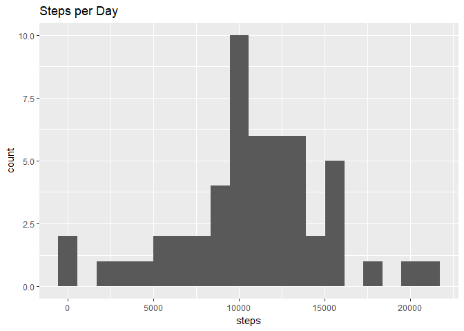
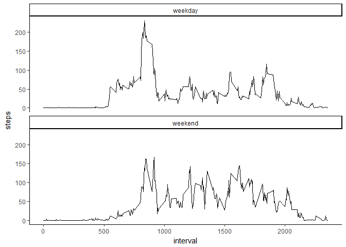

# Reproducible Research: Peer Assessment 1


## Loading and preprocessing the data

```r
require(ggplot2)
require(reshape2)
require(dplyr)

unzip("activity.zip")
activity <- read.csv("activity.csv", header = TRUE, 
                     na.strings = "NA", colClasses=c(NA, "Date", NA))
## What is mean total number of steps taken per day?
# melt and reshape the data summing across date
m <- melt(activity, id.vars = c("date", "interval"), na.rm = TRUE)
d1 <- dcast(m, date ~ variable, fun.aggregate = sum)

ggplot(d1, aes(x = steps)) + geom_histogram(bins=20) + 
  ggtitle("Steps per Day")
```

<!-- -->

## What is the average daily activity pattern?

```r
d2 <- dcast(m, interval ~ variable, fun.aggregate = mean)
p2 <- ggplot(d2, aes(x=interval, y=steps)) + geom_line() + 
  ggtitle("Mean steps per interval")

# report interval with max steps
d2$interval[d2$steps == max(d2$steps)]
```

```
## [1] 835
```

## Imputing missing values

```r
# determine number of missing values in the dataset
sum(is.na(activity))
```

```
## [1] 2304
```

```r
# fill in missing data using mean for that 5 minute interval using dplyr
# from stackoverflow https://stackoverflow.com/questions/30637522/impute-
# variables-within-a-data-frame-group-by-factor-column
imputed_activity <- activity %>% 
  group_by(interval) %>%
  mutate_each(funs(replace(.,which(is.na(.)), mean(., na.rm=TRUE))), 
              starts_with("steps"))

m_imput <- melt(imputed_activity, id.vars = c("date", "interval"), na.rm = TRUE)
d_imput <- dcast(m_imput, date ~ variable, fun.aggregate = sum)

p3 <- ggplot(d_imput, aes(x = steps)) + geom_histogram(bins=20) + 
  ggtitle("Steps per Day (with imputed value)")

#report the mean and median for the imputed data
mean(d_imput$steps)
```

```
## [1] 10766.19
```

```r
median(d_imput$steps)
```

```
## [1] 10766.19
```

## Are there differences in activity patterns between weekdays and weekends?

```r
imputed_activity$temp <- grepl("S(at|un)", weekdays(imputed_activity$date))
imputed_activity <- imputed_activity %>% mutate(daytype = if_else(temp==TRUE, 
                                                   "weekend", "weekday"))
imputed_activity$temp <- NULL

m4 <- melt(imputed_activity, id.vars = c("date", "interval", "daytype"))
d4 <- dcast(m4, interval + daytype ~ variable, fun.aggregate = mean)

ggplot(d4, aes(x=interval, y=steps)) + geom_line() + facet_wrap(~daytype, nrow = 2) + theme_classic()
```

<!-- -->
